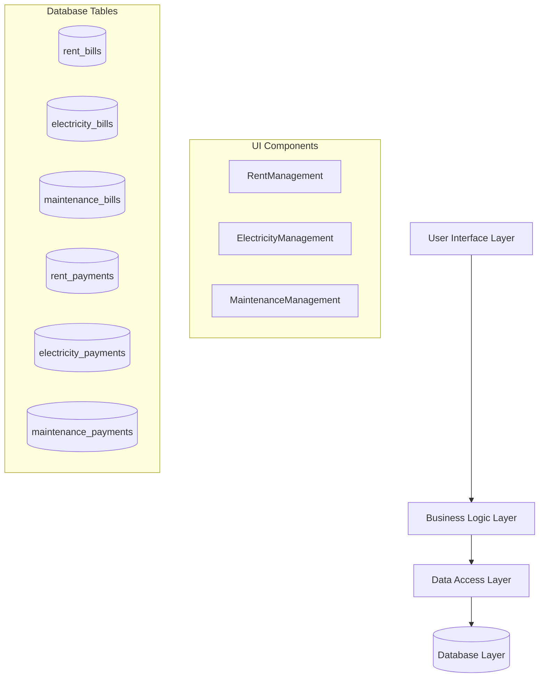
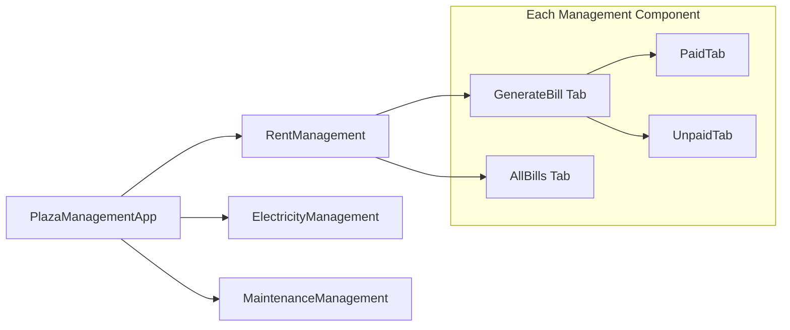

# Billing System Restructure - Design Document

## Overview

This design document outlines the complete architectural restructure of the plaza management billing system. The new system will separate bills by type (Rent, Electricity, Maintenance) with dedicated database tables, components, and management interfaces. Each business will receive 3 separate bills per month, and the system will provide type-specific generation, payment tracking, and status management.

## Architecture

### High-Level Architecture



### Component Architecture



## Components and Interfaces

### Database Schema Design

#### Rent Bills Table
```sql
CREATE TABLE rent_bills (
    id UUID PRIMARY KEY DEFAULT gen_random_uuid(),
    business_id UUID NOT NULL REFERENCES businesses(id),
    bill_number VARCHAR(50) UNIQUE NOT NULL,
    bill_date DATE NOT NULL,
    due_date DATE NOT NULL,
    amount DECIMAL(10,2) NOT NULL,
    bill_type VARCHAR(20) DEFAULT 'rent' CHECK (bill_type = 'rent'),
    status VARCHAR(20) DEFAULT 'pending' CHECK (status IN ('pending', 'paid', 'overdue', 'cancelled')),
    created_at TIMESTAMP DEFAULT NOW(),
    updated_at TIMESTAMP DEFAULT NOW()
);
```

#### Electricity Bills Table
```sql
CREATE TABLE electricity_bills (
    id UUID PRIMARY KEY DEFAULT gen_random_uuid(),
    business_id UUID NOT NULL REFERENCES businesses(id),
    bill_number VARCHAR(50) UNIQUE NOT NULL,
    bill_date DATE NOT NULL,
    due_date DATE NOT NULL,
    amount DECIMAL(10,2) NOT NULL,
    units_consumed INTEGER,
    rate_per_unit DECIMAL(8,4),
    previous_reading INTEGER,
    current_reading INTEGER,
    bill_type VARCHAR(20) DEFAULT 'electricity' CHECK (bill_type = 'electricity'),
    status VARCHAR(20) DEFAULT 'pending' CHECK (status IN ('pending', 'paid', 'overdue', 'cancelled')),
    created_at TIMESTAMP DEFAULT NOW(),
    updated_at TIMESTAMP DEFAULT NOW()
);
```

#### Maintenance Bills Table
```sql
CREATE TABLE maintenance_bills (
    id UUID PRIMARY KEY DEFAULT gen_random_uuid(),
    business_id UUID NOT NULL REFERENCES businesses(id),
    bill_number VARCHAR(50) UNIQUE NOT NULL,
    bill_date DATE NOT NULL,
    due_date DATE NOT NULL,
    amount DECIMAL(10,2) NOT NULL,
    description TEXT,
    category VARCHAR(50),
    bill_type VARCHAR(20) DEFAULT 'maintenance' CHECK (bill_type = 'maintenance'),
    status VARCHAR(20) DEFAULT 'pending' CHECK (status IN ('pending', 'paid', 'overdue', 'cancelled')),
    created_at TIMESTAMP DEFAULT NOW(),
    updated_at TIMESTAMP DEFAULT NOW()
);
```

#### Payment Tables
```sql
-- Rent Payments
CREATE TABLE rent_payments (
    id UUID PRIMARY KEY DEFAULT gen_random_uuid(),
    business_id UUID NOT NULL REFERENCES businesses(id),
    bill_id UUID NOT NULL REFERENCES rent_bills(id),
    payment_date DATE NOT NULL,
    amount DECIMAL(10,2) NOT NULL,
    payment_method VARCHAR(20) NOT NULL CHECK (payment_method IN ('cash', 'cheque', 'bank_transfer', 'upi', 'card')),
    reference_number VARCHAR(100),
    notes TEXT,
    created_at TIMESTAMP DEFAULT NOW()
);

-- Electricity Payments (similar structure)
-- Maintenance Payments (similar structure)
```

### TypeScript Interfaces

```typescript
// Base Bill Interface
interface BaseBill {
    id: string;
    business_id: string;
    bill_number: string;
    bill_date: string;
    due_date: string;
    amount: number;
    bill_type: string;
    status: 'pending' | 'paid' | 'overdue' | 'cancelled';
    created_at: string;
    updated_at: string;
}

// Specific Bill Types
interface RentBill extends BaseBill {
    bill_type: 'rent';
}

interface ElectricityBill extends BaseBill {
    bill_type: 'electricity';
    units_consumed?: number;
    rate_per_unit?: number;
    previous_reading?: number;
    current_reading?: number;
}

interface MaintenanceBill extends BaseBill {
    bill_type: 'maintenance';
    description?: string;
    category?: string;
}

// Payment Interfaces
interface BasePayment {
    id: string;
    business_id: string;
    bill_id: string;
    payment_date: string;
    amount: number;
    payment_method: 'cash' | 'cheque' | 'bank_transfer' | 'upi' | 'card';
    reference_number?: string;
    notes?: string;
    created_at: string;
}

interface RentPayment extends BasePayment {
    bill_id: string; // References rent_bills.id
}

interface ElectricityPayment extends BasePayment {
    bill_id: string; // References electricity_bills.id
}

interface MaintenancePayment extends BasePayment {
    bill_id: string; // References maintenance_bills.id
}
```

### Component Design

#### RentManagement Component
```typescript
interface RentManagementProps {
    activeSubSection: string; // 'rent-generate' | 'rent-all'
}

export function RentManagement({ activeSubSection }: RentManagementProps) {
    // State management for rent bills and payments
    // Tabbed interface for Generate Bill (Paid/Unpaid) and All Bills
    // Bill generation logic specific to rent
    // Payment recording for rent bills
    // Status management with dropdowns
}
```

#### ElectricityManagement Component
```typescript
interface ElectricityManagementProps {
    activeSubSection: string; // 'electricity-generate' | 'electricity-all'
}

export function ElectricityManagement({ activeSubSection }: ElectricityManagementProps) {
    // State management for electricity bills and payments
    // Integration with meter readings
    // Calculation logic for electricity charges
    // Tabbed interface similar to rent management
}
```

#### MaintenanceManagement Component
```typescript
interface MaintenanceManagementProps {
    activeSubSection: string; // 'maintenance-generate' | 'maintenance-all'
}

export function MaintenanceManagement({ activeSubSection }: MaintenanceManagementProps) {
    // State management for maintenance bills and payments
    // Category-based billing
    // Custom amount and description handling
    // Tabbed interface similar to other components
}
```

## Data Models

### Bill Numbering System

```typescript
class BillNumberGenerator {
    static generateRentBillNumber(year: number, sequence: number): string {
        return `RENT-${year}-${sequence.toString().padStart(3, '0')}`;
    }
    
    static generateElectricityBillNumber(year: number, sequence: number): string {
        return `ELEC-${year}-${sequence.toString().padStart(3, '0')}`;
    }
    
    static generateMaintenanceBillNumber(year: number, sequence: number): string {
        return `MAINT-${year}-${sequence.toString().padStart(3, '0')}`;
    }
}
```

### Database Service Layer

```typescript
class RentBillService {
    async getRentBills(businessId?: string): Promise<RentBill[]>
    async createRentBill(bill: Omit<RentBill, 'id' | 'created_at' | 'updated_at'>): Promise<RentBill>
    async updateRentBill(id: string, updates: Partial<RentBill>): Promise<RentBill>
    async deleteRentBill(id: string): Promise<void>
}

class ElectricityBillService {
    async getElectricityBills(businessId?: string): Promise<ElectricityBill[]>
    async createElectricityBill(bill: Omit<ElectricityBill, 'id' | 'created_at' | 'updated_at'>): Promise<ElectricityBill>
    async updateElectricityBill(id: string, updates: Partial<ElectricityBill>): Promise<ElectricityBill>
    async deleteElectricityBill(id: string): Promise<void>
}

class MaintenanceBillService {
    async getMaintenanceBills(businessId?: string): Promise<MaintenanceBill[]>
    async createMaintenanceBill(bill: Omit<MaintenanceBill, 'id' | 'created_at' | 'updated_at'>): Promise<MaintenanceBill>
    async updateMaintenanceBill(id: string, updates: Partial<MaintenanceBill>): Promise<MaintenanceBill>
    async deleteMaintenanceBill(id: string): Promise<void>
}
```

## Error Handling

### Database Error Handling
- **Constraint Violations:** Handle unique bill number conflicts
- **Foreign Key Errors:** Validate business_id references
- **Connection Errors:** Implement retry logic and user feedback

### Component Error Handling
- **Loading States:** Show loading indicators during data operations
- **Validation Errors:** Client-side validation for bill amounts and dates
- **Network Errors:** Graceful degradation and error messages

### Bill Generation Error Handling
- **Duplicate Bills:** Check for existing bills before generation
- **Missing Data:** Validate required business information
- **Calculation Errors:** Handle meter reading and rate calculation failures

## Testing Strategy

### Unit Testing
- **Database Services:** Test CRUD operations for each bill type
- **Bill Number Generation:** Test unique number generation logic
- **Component Logic:** Test state management and user interactions
- **Validation Functions:** Test input validation and error handling

### Integration Testing
- **Database Integration:** Test table relationships and constraints
- **Component Integration:** Test data flow between components
- **Payment Processing:** Test payment recording and bill status updates
- **Navigation:** Test routing between different bill type sections

### End-to-End Testing
- **Bill Generation Workflow:** Test complete bill generation process
- **Payment Recording Workflow:** Test payment recording and status updates
- **Status Management:** Test paid/unpaid status changes
- **Multi-Bill Scenarios:** Test businesses with multiple bill types

### Performance Testing
- **Large Dataset Handling:** Test with multiple businesses and bills
- **Concurrent Operations:** Test simultaneous bill generation and payments
- **Database Query Performance:** Optimize queries for bill retrieval and filtering

## Migration Strategy

### Phase 1: Database Schema Creation
1. Create new bill tables (rent_bills, electricity_bills, maintenance_bills)
2. Create new payment tables (rent_payments, electricity_payments, maintenance_payments)
3. Add indexes and constraints
4. Test table creation and relationships

### Phase 2: Database Service Layer
1. Implement type-specific database services
2. Create bill number generation logic
3. Implement CRUD operations for each bill type
4. Add error handling and validation

### Phase 3: Component Development
1. Create RentManagement component
2. Create ElectricityManagement component  
3. Create MaintenanceManagement component
4. Implement tabbed interfaces and status management

### Phase 4: Navigation and Integration
1. Update navigation structure
2. Integrate new components with main app
3. Remove legacy components and routes
4. Update routing logic

### Phase 5: Database Cleanup
1. Drop legacy tables (bills, payments, maintenance_bills, etc.)
2. Clean up unused database functions
3. Update database documentation
4. Verify data integrity

### Phase 6: Testing and Deployment
1. Run comprehensive test suite
2. Performance testing with realistic data
3. User acceptance testing
4. Production deployment

## Security Considerations

### Data Access Control
- **Row Level Security:** Implement RLS policies for each bill table
- **User Permissions:** Ensure users can only access authorized business data
- **API Security:** Validate user permissions for bill operations

### Input Validation
- **Amount Validation:** Prevent negative amounts and excessive values
- **Date Validation:** Ensure valid date ranges and logical due dates
- **Business Validation:** Verify business exists and is active

### Audit Trail
- **Change Tracking:** Log bill status changes and payment records
- **User Activity:** Track who performs bill operations
- **Data Integrity:** Maintain referential integrity across tables